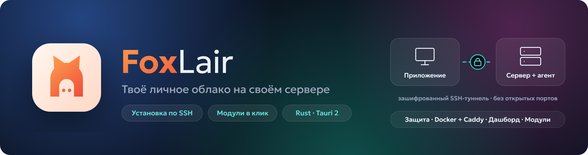
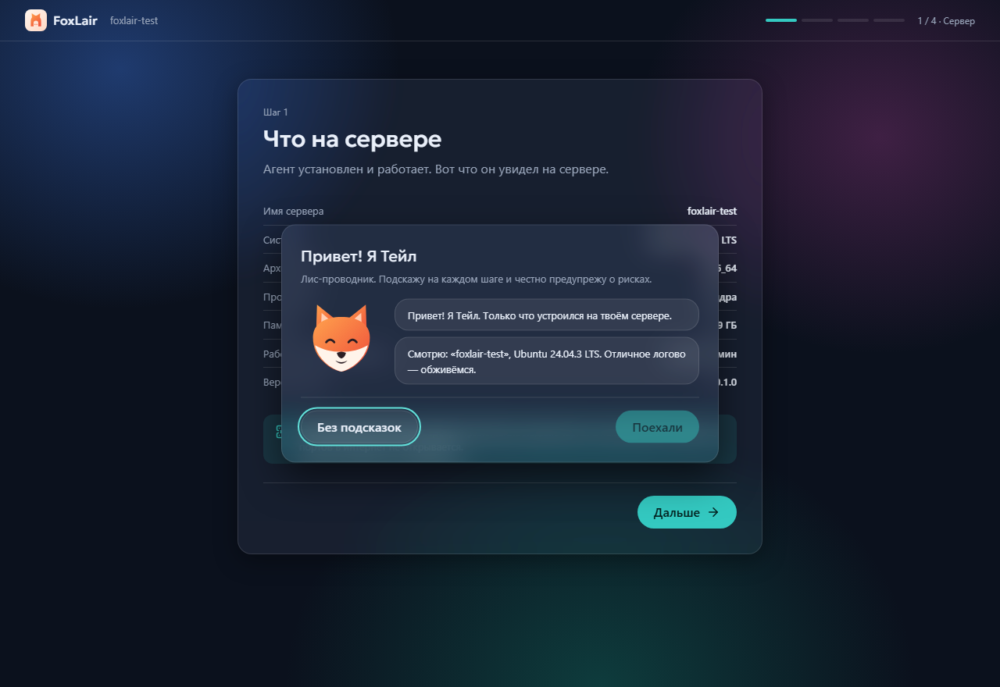
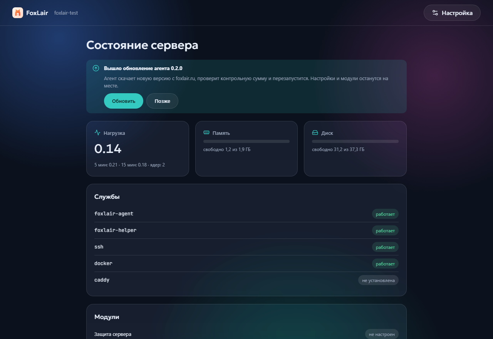

 

**Enter your server details — FoxLair turns it into a secured personal cloud.**

The desktop app connects over SSH, installs an agent and then walks you through setup:
protection, Docker, VPN, dashboard. Modules are added with one click.

 

---

## What it is

You have a VPS or a home server but no desire to learn Linux administration. FoxLair does the work:

- **Connects over SSH** — checks the server fingerprint, privileges, disk, memory and storage media.
- **Installs an agent** — a small service that runs only the app's commands and opens no ports to the internet.
- **Forgets the password** — afterwards it signs in with your computer's key.
- **Protects the server** — key-only login, firewall, fail2ban, automatic security updates.
- **Installs modules** — Docker, Caddy, VPN, DNS: one click from the store.
- **Shows a dashboard** — load, memory, disk, services and module state, no terminal needed.

A fox guide named **Tail** explains every step: what will happen, why it helps and what the risk is.
Nothing changes without your confirmation.

## Screenshots

<table>
<tr>
<td width="50%"></td>
<td width="50%"></td>
</tr>
</table>

Three interface styles (Graphite, Glass, Terminal), light and dark themes, desktop and phone,
Russian and English.

## Install

1. Download the installer from [Releases](https://github.com/DiFoxenGit/foxlair/releases/latest) or [foxlair.ru](https://foxlair.ru).
2. Run it and pick language, style and theme.
3. Enter the server address, user and password from your hosting provider.
4. Confirm the server fingerprint and wait for the agent — everything else happens on the agent page.

**Server requirements:** Ubuntu 22.04 or 24.04 LTS, x86_64 or ARM64, 512 MB RAM and 2 GB free space.

> [!NOTE]
> The app is not signed with a certificate authority yet, so Windows shows a SmartScreen warning:
> "More info" → "Run anyway". Agent updates are signed with the project key and verified before install.

## Security

- The server key fingerprint is shown on first connection and checked on every one after.
- The server password is never stored: it is only needed to install the agent.
- Your computer's key and access tokens live in the operating system credential store.
- The agent API requires a token, listens on loopback only and checks the `Host` header.
- Agent updates are downloaded over HTTPS and verified by SHA-256 and an Ed25519 signature.

Found a vulnerability? Use a [private report](https://github.com/DiFoxenGit/foxlair/security/advisories/new) — see [SECURITY.md](SECURITY.md).

## Feedback

Bugs and ideas — in [Issues](https://github.com/DiFoxenGit/foxlair/issues). Russian or English is fine.

## License

Proprietary software, all rights reserved — see [LICENSE](LICENSE).

 © 2026 DiFoxen · FoxLair · <a href="README.md">Русский</a>

