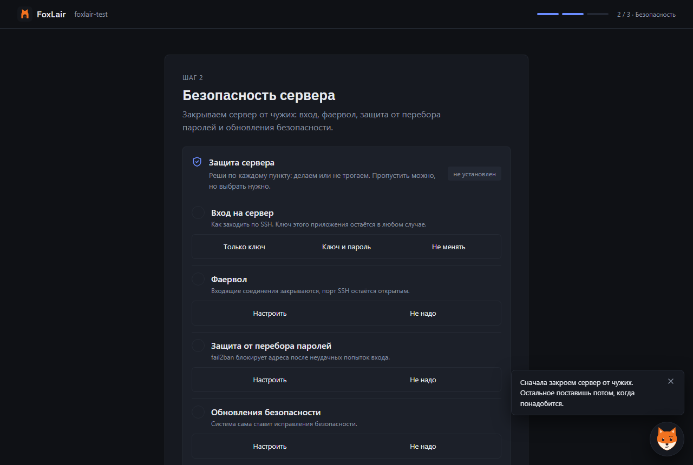
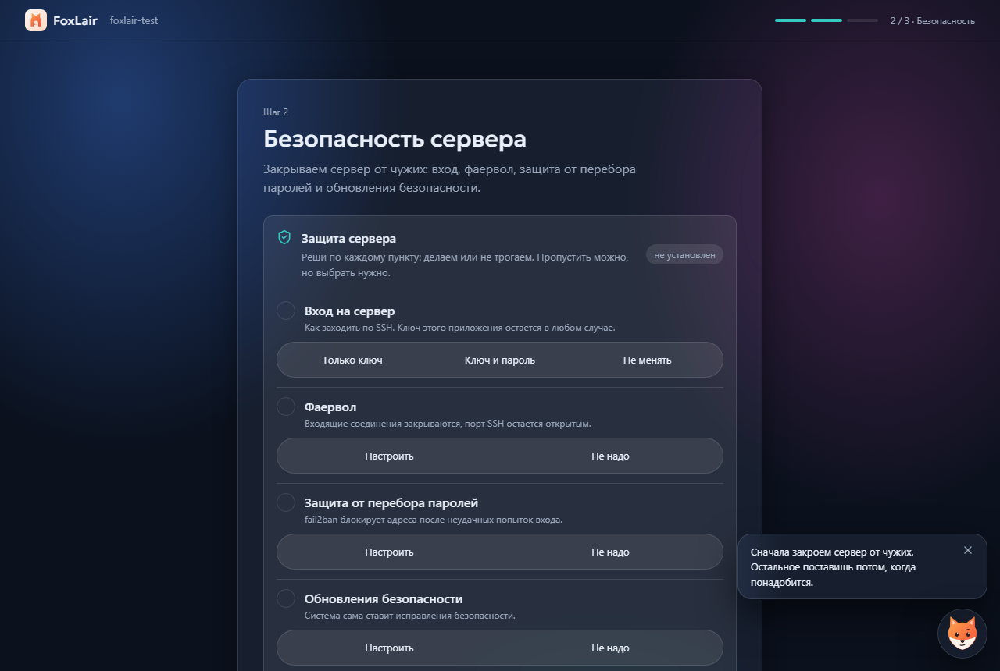
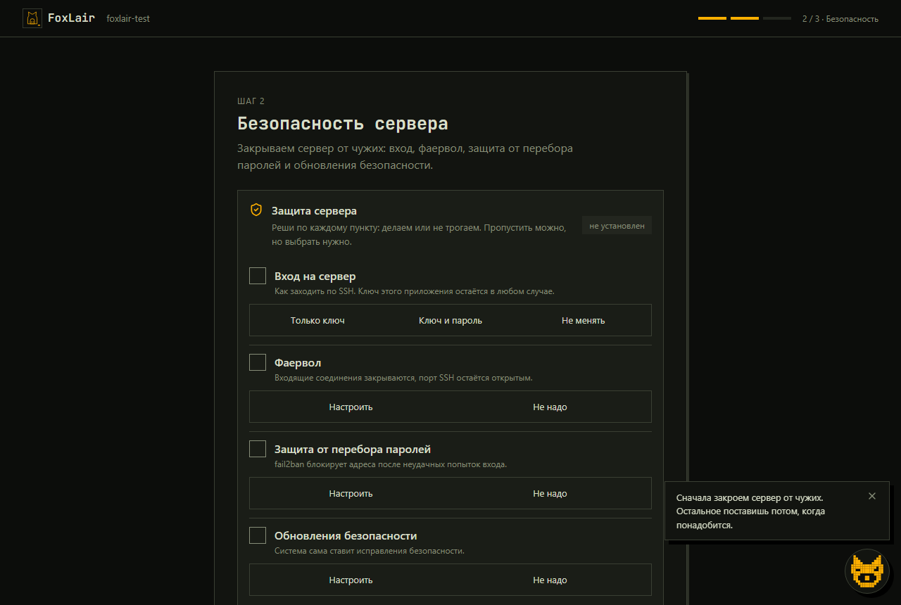
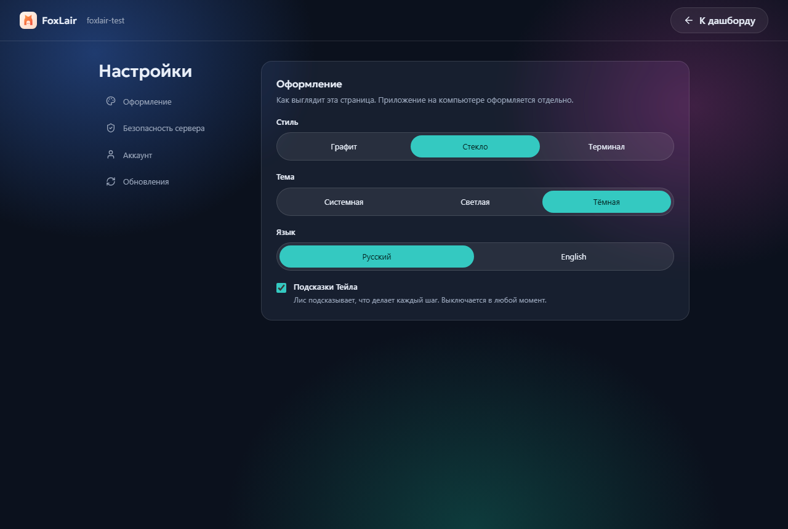
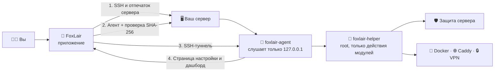

 

**Вводишь данные сервера — FoxLair превращает его в защищённое личное облако.**

Приложение подключается по SSH, ставит агента и дальше ведёт настройку в понятном мастере:
защита, Docker, VPN, дашборд. Модули добавляются одним нажатием.

 

[**Что это**](#-что-это) ·
[**Как выглядит**](#-как-выглядит) ·
[**Как устроено**](#️-как-устроено) ·
[**Установка**](#-установка) ·
[**Безопасность**](#-безопасность)

---

## 🎯 Что это

У вас есть VPS или домашний сервер, но нет желания разбираться в Linux. FoxLair делает всю работу за вас:

| | |
|---|---|
| 🔌 **Подключается по SSH** | Проверяет отпечаток сервера, права, место, память, носитель системы |
| 🦊 **Ставит агента** | Небольшую службу, которая выполняет только команды приложения и не открывает портов наружу |
| 🔑 **Забывает пароль** | После установки заходит по ключу вашего компьютера — пароль сервера больше не нужен |
| 🛡 **Защищает сервер** | Вход по ключу, фаервол, fail2ban, автообновления — каждая часть по отдельности |
| 🧩 **Ставит модули** | Docker, Caddy, VPN, DNS — из магазина, одним нажатием |
| 📊 **Показывает дашборд** | Нагрузка, память, диск, службы и состояние модулей — без терминала |

Каждый шаг объясняет лис-проводник **Тейл**: что произойдёт, чем это полезно и чем рискованно.
Ничего не меняется без вашего подтверждения.

## 🖼 Как выглядит

<table>
<tr>
<td width="50%"></td>
<td width="50%"></td>
</tr>
<tr>
<td align="center">Тейл встречает сразу после установки агента</td>
<td align="center">Дашборд: нагрузка, память, диск, службы, модули</td>
</tr>
</table>

### Три стиля интерфейса

Один и тот же шаг настройки безопасности — стиль выбирается при первом запуске и переносится на сервер.

<table>
<tr>
<td width="33%"></td>
<td width="33%"></td>
<td width="33%"></td>
</tr>
<tr>
<td align="center"><b>Графит</b> строгий и плотный</td>
<td align="center"><b>Стекло</b> по умолчанию</td>
<td align="center"><b>Терминал</b> моноширинный, с пиксельным Тейлом</td>
</tr>
</table>

Каждый стиль — со светлой и тёмной темой, на компьютере и на телефоне. Русский и английский.

Настройки сервера: оформление, безопасность, аккаунт и обновления — по разделам

## ⚙️ Как устроено

- **Наружу ничего не открывается.** Агент слушает только сам сервер, приложение приходит по SSH-туннелю.
- **Пароль нужен один раз.** Дальше вход по ключу вашего компьютера, который хранится в хранилище паролей системы.
- **Систему меняет только помощник** и только теми действиями, что описаны в модулях: произвольных команд в протоколе нет.
- **Настройка переживает перезагрузку.** Каждый шаг пишется в журнал: незавершённый повторится, выполненный — пропустится.

## 📥 Установка

1. Скачайте установщик со страницы [релизов](https://github.com/DiFoxenGit/foxlair/releases/latest) или с [foxlair.ru](https://foxlair.ru).
2. Запустите и выберите язык, стиль и тему.
3. Введите адрес сервера, логин и пароль, которые прислал хостинг.
4. Подтвердите отпечаток сервера и дождитесь установки агента — дальше всё происходит на странице агента.

**Что нужно от сервера:** Ubuntu 22.04 или 24.04 LTS, x86_64 или ARM64, от 512 МБ памяти и 2 ГБ свободного места.
Подойдёт любой VPS, домашний компьютер или Raspberry Pi (лучше не с SD-карты — приложение предупредит).

> [!NOTE]
> Приложение пока не подписано сертификатом удостоверяющего центра, поэтому Windows покажет предупреждение SmartScreen:
> «Подробнее» → «Выполнить в любом случае». Обновления агента подписаны ключом проекта и проверяются перед установкой.

## 🛡 Безопасность

- Отпечаток ключа сервера показывается при первом подключении и сверяется при каждом следующем.
- Пароль сервера не сохраняется: он нужен только для установки агента.
- Ключ вашего компьютера и токены доступа лежат в хранилище паролей операционной системы, а не в файлах приложения.
- API агента закрыт токеном, доступен только с самого сервера и проверяет заголовок `Host` — страница из интернета до него не достучится.
- Обновления агента скачиваются по HTTPS, сверяются по SHA-256 и подписи Ed25519; ставит их привилегированная служба, а не сам агент.
- Шаг «Вход только по ключу» не отключит пароль, пока не убедится, что вход по ключу работает.
- Защита собирается по частям: по каждой — вход, фаервол, fail2ban, обновления — вы решаете сами,
  и отказ от части не просто пропускает её, а возвращает сервер к тому, что было до неё.

Нашли уязвимость? Напишите через [приватный отчёт GitHub](https://github.com/DiFoxenGit/foxlair/security/advisories/new) — см. [SECURITY.md](SECURITY.md).

## 🗺 Дорожная карта

- [x] Установка агента по SSH и защищённый туннель
- [x] Вход без пароля: ключ устройства и токен агента
- [x] Модули: защита сервера, Docker, Caddy
- [x] Дашборд сервера и обновления агента с проверкой подписи
- [x] Магазин модулей: каталог приходит с сервера проекта, пакеты подписаны
- [x] VPN на AmneziaWG: устройства с QR-кодом, маршруты и маскировка
- [x] DNS с блокировкой рекламы
- [ ] Хранилище, фото, кино, игровые серверы
- [ ] macOS и Linux, мобильное приложение

## ❓ Частые вопросы

<b>Что будет с тем, что уже стоит на сервере?</b>

 

Перед установкой FoxLair читает сервер и показывает, что нашёл. Перед каждым изменением показывает план
и ждёт подтверждения. Модуль «Caddy» откажется работать, если порты 80 и 443 занял чужой веб-сервер,
а не станет его перенастраивать.

<b>Нужно ли уметь работать в терминале?</b>

 

Нет. Нужны только адрес сервера, логин и пароль из письма хостинга. Всё остальное делает приложение
и объясняет простыми словами.

<b>Что если я потеряю компьютер с ключом?</b>

 

Сервер останется вашим: зайти можно через консоль хостинга и добавить новый ключ. Коды восстановления
на такой случай появятся в одном из ближайших обновлений.

<b>Здесь есть исходный код?</b>

 

Нет, это витрина: репозиторий нужен для релизов, обсуждений и сообщений об ошибках.
Код закрыт, но всё, что агент делает с сервером, видно в плане изменений перед применением.

## 💬 Обратная связь

Ошибки и идеи — во [вкладке Issues](https://github.com/DiFoxenGit/foxlair/issues). Пишите по-русски или по-английски.

## 📄 Лицензия

Проприетарное ПО, все права защищены — см. [LICENSE](LICENSE).

 © 2026 DiFoxen · FoxLair — твоё личное облако · <a href="README.en.md">English</a>

